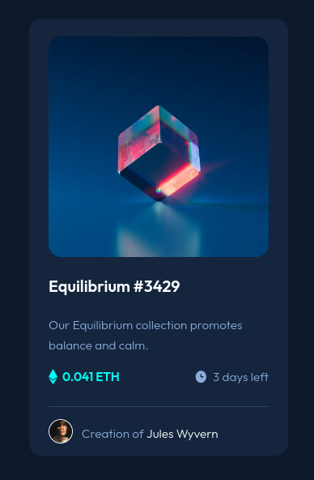

# Frontend Mentor - NFT preview card component solution

This is a solution to the [NFT preview card component challenge on Frontend Mentor](https://www.frontendmentor.io/challenges/nft-preview-card-component-SbdUL_w0U). Frontend Mentor challenges help you improve your coding skills by building realistic projects. 

## Table of contents

- [Overview](#overview)
  - [The challenge](#the-challenge)
  - [Screenshot](#screenshot)
  - [Links](#links)
- [My process](#my-process)
  - [Built with](#built-with)
  - [Useful resources](#useful-resources)
- [Author](#author)

## Overview

### The challenge

Users should be able to:

- View the optimal layout depending on their device's screen size
- See hover states for interactive elements

### Screenshot

### Links

- Solution URL: [Frontend Mentor Solution](https://www.frontendmentor.io/solutions/nft-preview-component-with-flexbox-qbn3jS9X0)
- Live Site URL: [Github pages](https://kmullen444.github.io/NFT-comp-HTML/)

## My process

### Built with

- Semantic HTML5 markup
- CSS custom properties
- Flexbox
- Mobile-first workflow

### Useful resources

- [W3schools](https://www.w3schools.com/cssref/default.asp) - References of CSS properties and examples.
- [Markdown Guide](http://www.markdownguide.org/cheat-sheet) - Tables of Markdown syntax used for this README.
- [MDN Web Docs](https://developer.mozilla.org/en-US/docs/Web/css) - References of CSS properties and examples.
- [Image Hover Overlay](https://www.w3schools.com/howto/howto_css_image_overlay.asp) - Examples of the different hover overlay through css

## Author

- Website - [Kevin Mullen](https://www.kevinmullen.net)
- Frontend Mentor - [@Kmullen444](https://www.frontendmentor.io/profile/Kmullen444)
